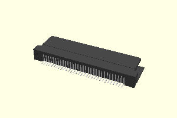
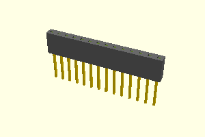
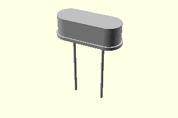

# willdurand-kicad-libs

## Installation

1. Get a local copy of this repository (_e.g._, `/path/to/kicad_libs/willdurand-kicad-libs`)
2. Import the `*.lib` files as Global or Project Symbol Libraries in _Eeschema_
3. Import the `*.pretty` files as Global or Project Footprint Libraries in _Pcbnew_
4. Configure a new 3d shape alias named `willdurand-kicad-libs` that points to `/path/to/kicad_libs/willdurand-kicad-libs` in _Pcbnew_

## Usage

This repository contains several libraries. Each library provides several
symbols along with their footprints. Some symbols have 3D shapes too! 3D shapes
have been created with [OpenSCAD](https://www.openscad.org/) and transformed
into `.step` files using [FreeCAD](https://www.freecadweb.org/) (_via_ `.csg`
files).

### willdurand_connector

| Symbol      | Description                                                                                                     | 3D Shape                                                             |
| ----------- | --------------------------------------------------------------------------------------------------------------- | -------------------------------------------------------------------- |
| GB_GBC_1x32 | 32 Pin card slot connector for GameBoy/GameBoy Color ([link](https://www.aliexpress.com/item/32832493101.html)) |  |

#### Footprints (without symbols)

| Name               | Description                                                                                | 3D Shape                                                                           |
| ------------------ | ------------------------------------------------------------------------------------------ | ---------------------------------------------------------------------------------- |
| LongPinSocket_1x14 | 14 pins socket with long pins based on KiCad's 1x14 pin socket footprint                   |  |
| HC49US             | Crystal Oscillator HC-49S 16MHz ([link](https://www.aliexpress.com/item/32452467829.html)) |                            |

## License

All the files are released under the [Creative Commons Attribution-ShareAlike 4.0 International (CC BY-SA 4.0) license](https://creativecommons.org/licenses/by-sa/4.0/).
